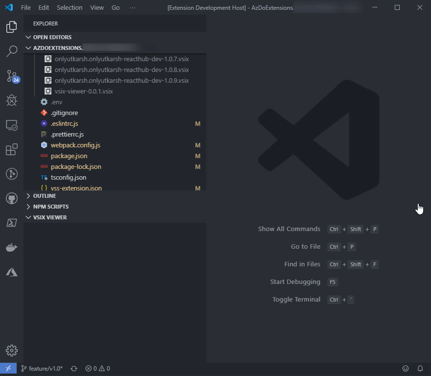

# VSIX Viewer

A simple viewer for VSIX files, which lets you see the contents of VSIX files within Visual Studio Code. 




## Usage

Right click on a VSIX file and select `Show in VSIX Viewer`. This will parse the VSIX file and shows it in the a tree view in the `VSIX Viewer`.

## Telemetry data

By default, anonymous usage and error data collection is turned on to understand user behaviour to improve this extension. To disable it, update the `settings.json` as below:
```json
{
    "vsixViewer.enableTelemetry": false
}
```

## Change Log

See Change Log [here](CHANGELOG.md)

## Issues

If you find any bug or have any suggestion/feature request, please submit the issues to the GitHub repo.

## Credits

Some icons comes from the brilliant [vscode-icons](https://github.com/robertohuertasm/vscode-icons) extension for Visual Studio Code.
